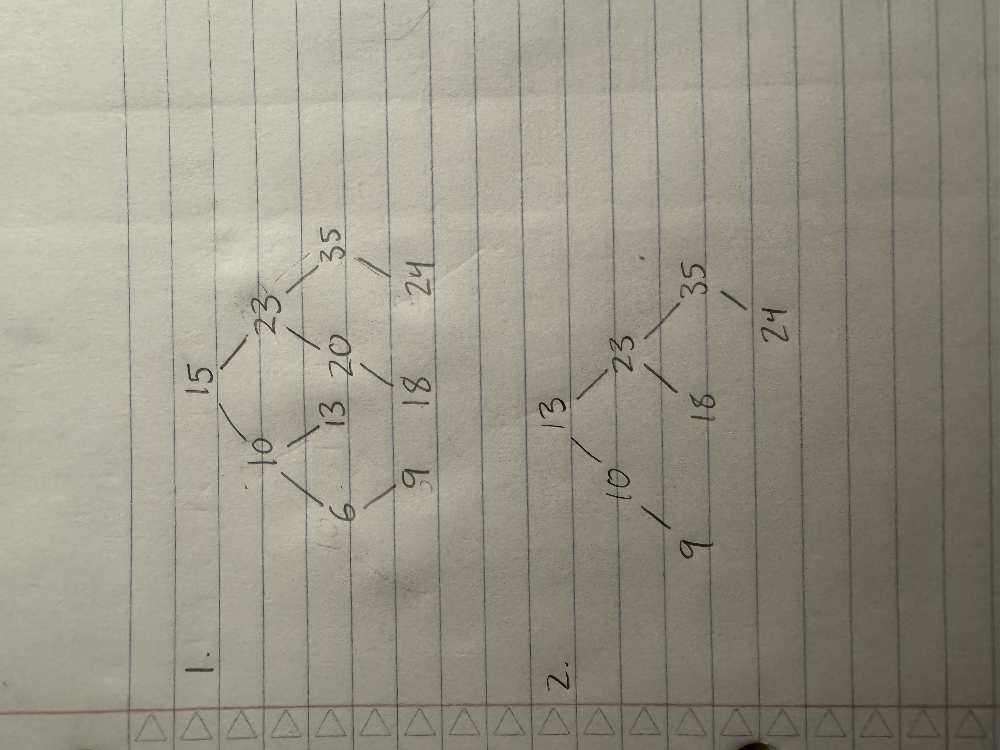

# Task 1: Review binary-tree basics

1. E has a depth of 2, and A has a depth of 4.
2. The height of the tree is 4.
3. Preorder: GECDAHKFM
4. Inorder: CEADGHFKM
5. Postorder: CADEFMKHG
6. Level-order: GEHCDKAFM

# Task 2: Work with binary search trees

# Task 3: Work with the LinkedTree class

3. Recursion because iteration would require you to traverse every subtree individually in order to sum each part of the tree; iteration would simply be more complicated than recursion in this case.

# Task 4: More questions

1. No because E's children are both less than it in alphabetical order.
3. No, as H's subtree heights do not match.
4. Yes, the tree is balanced.